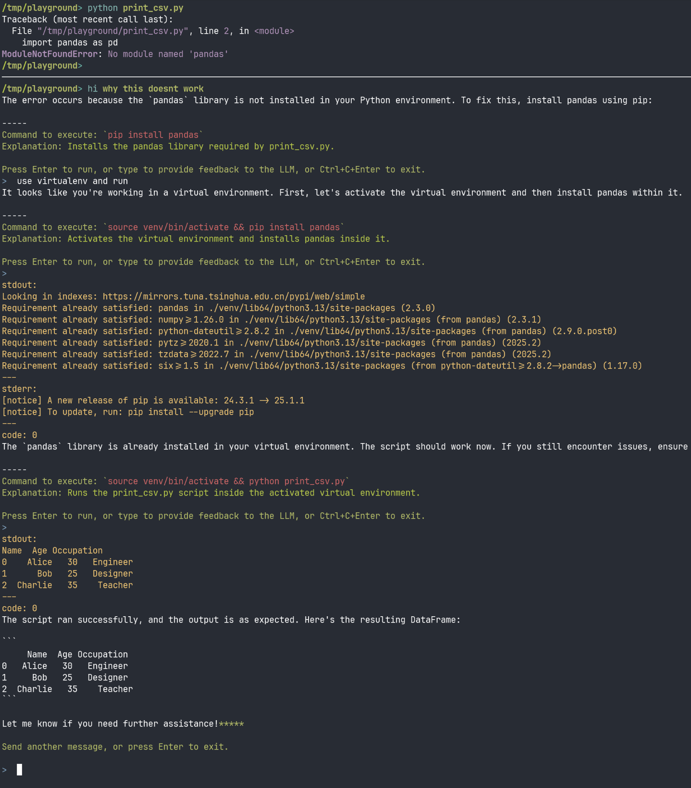

<div align="center">
  <h1>hi</h1>
  <p><strong>A fast terminal-native AI assistant that sees what you see.</strong></p>
  <p>
    <!-- <a href="https://github.com/twofyw/hi/releases/latest"></a> -->
    <a href="https://github.com/twofyw/hi/blob/main/LICENSE"></a>
    <!-- <a href="https://github.com/twofyw/hi/actions"></a> -->
  </p>
</div>




`hi` isn't just another AI chat wrapper or fully autonomous coding agent - it's a context-aware terminal assistant that operates within your workflow. It sees what you see - your terminal window, eliminating context switching and copy-pasting.

`hi` is terminal-native. It focuses on **writing and executing shell commands** to solve problems, not just watch and chat. Designed for terminal users of all skill levels, it delivers a seamless AI experience without vendor lock-in.

## ✨ Features
### Context Awareness
- **👁️‍🗨️ Automatic Window Capture** - Captures tmux window content as context
- **📜 History Awareness** - References scrollback without manual recall
- **🪟 Multi-Pane Understanding** - Processes content from all visible panes


### Workflow Integration
- **⏱️ Instant Activation** - `hi what do you see` captures context automatically
- **↩️ Error Recovery** - `hi fix last command` understands failed command output
- **🧹 Clean Demonstration** - `hi whats wrong in the other pane?` read isolated demonstration panes for AI context

### Action-Oriented
- **🛠️ Shell Command Execution** - `hi explore this system` writes and executes commands to achieve goals
- **✅ Safe Execution** - Confirmation layer for destructive command prevention

### Performance
- **🔌 Any LLM API** - LangChain inside
- **📉 Low Token Usage** - Efficient prompting minimizes costs
- **⚡️ Fast Mode** - Quick queries via `hi -f` with lightweight models


## 🤔 Why `hi`?

While tools like Claude Coder, Gemini CLI, or Codex serve specific purposes, `hi` is purpose-built as a flexible terminal assistant:

| Feature               | `hi`                                       | Alternatives (Claude/Gemini/Codex)      |
|-----------------------|--------------------------------------------|------------------------------------------|
| **Terminal Integration** | ✅ Deep tmux integration                  | ❌ Limited or no terminal awareness       |
| **Workflow**          | ✅ Context-aware command execution         | ❌ Manual history transfer required       |
| **Backend Flexibility**| ✅ Multi-provider (Ollama, OpenAI, etc.)   | ❌ Vendor-locked               |
| **Cost Efficiency**   | ✅ Free local models + token optimization  | 🔶 API usage billing                     |
| **Focus**             | Terminal productivity                      | Specialized coding                    |


**Use editor Copilots for coding — use `hi` for working in the terminal.**

### Simple task cost comparison
For simpler terminal tasks, gemini spends far more tokens and way longer than hi.

|           | Gen UUID         | Fix Python Module not found error |
|----------|------------------|-----------------|
|   hi    |  726 tokens in 5s | 4k tokens in 18s |
|gemini-cli|28k tokens in 50s | 30k tokens in 62s |

Note: The "Fix Python Module not found error" example is walked through in the Usage section below.

## 🚀 Installation

```bash
pip install git+https://github.com/twofyw/hi.git@main
```


## ⚙️ Configuration

`hi` uses a YAML config file at `~/.config/hi/config.yaml`. On first run, it creates a default configuration you can customize.

### Basic Setup


Example `~/.config/tmuxai/config.yaml`:
```yaml
# Default model: "smart" (capable) or "fast" (lightweight)
default_model: "smart"

# Configuration for the primary, more capable model.
smart_model:
  # The model name in 'provider/model_name' format.
  # Supported providers include openai, anthropic, google, ollama, etc.
  # See LangChain documentation for init_chat_model for a full list.
  fully_specified_name: "openai/gpt-4o"
  # api_key: "sk-..." # Optional if set via OPENAI_API_KEY
  # base_url: "https://api.openai.com/v1" # Optional if set via OPENAI_API
  # kwargs:
  #   temperature: 0.7  # Control creativity (0-1)

# Optional: Configuration for a faster, potentially less capable model.
# Activated with the -f or --fast flag.
fast_model:
  fully_specified_name: "ollama/llama3:8b"
  # For local models via Ollama, no api_key is needed.
  # base_url is typically http://localhost:11434 if not default.
  # kwargs:
  #   temperature: 0.6

# Timeout for shell commands (seconds)
command_timeout: 15

# Custom system prompt
# system_prompt: >
#   You're a helpful terminal assistant.
#   Respond concisely with terminal commands when appropriate.
```

API key and base url can also be set via environment variables in `~/.config/hi/env`:
```
OPENAI_API_KEY=
OPENAI_BASE_URL=

ANTHROPIC_API_KEY=
GOOGLE_API_KEY=
...
```

## 💻 Usage
### Quick Start
```
$ tmux
$ hi go ahead and explore the system
```

### Multi-Pane Context Awareness Example
First, let's ask `hi` to prepare some data for us
```bash
$ hi generate some csv data to data.csv. write print_csv.py that loads the csv into a pandas dataframe and print it

$ cat data.csv
Name,Age,Occupation
Alice,30,Engineer
Bob,25,Designer
Charlie,35,Teacher

$ cat print_csv.py
import pandas as pd

df = pd.read_csv('data.csv')
print(df)
```

Now if we try to run the python script, it will complain that no module named 'pandas' is found, because we are (deliberately) not using an environment with pandas installed. Let's ask hi to help us again:


Note how we seamlessly provide context to hi using a tmux pane within the same window, eliminating the need to repeat the full problem for the LLM. hi sees exactly what you see.


## TODO
The project is under active development. Here's what's on the roadmap:
- [ ] **Context Length Display**: Show the user how much context is being sent to the model to help manage token usage.
- [ ] **Multi-Agent Mode**: Scale to multi agent architecture to support more complex tasks and longer context. This should be easy to implement since `hi` is built using the versatile Langgraph framework, though supporting complex task isn't the primary goal of this project.
- [ ] **Run outside of tmux**: Support a non-tmux mode for basic interaction as well as a --no-capture flag.
- [ ] Upload to PyPI
- [ ] Long Term Memory

## 🤝 Contributing

Contributions are welcome! Please feel free to submit a pull request or open an issue.

1. Fork the repository.
2. Create your feature branch (`git checkout -b feature/AmazingFeature`).
3. Commit your changes (`git commit -m 'Add some AmazingFeature'`).
4. Push to the branch (`git push origin feature/AmazingFeature`).
5. Open a Pull Request.

## 📄 License

This project is licensed under the MIT License. See the `LICENSE` file for details.